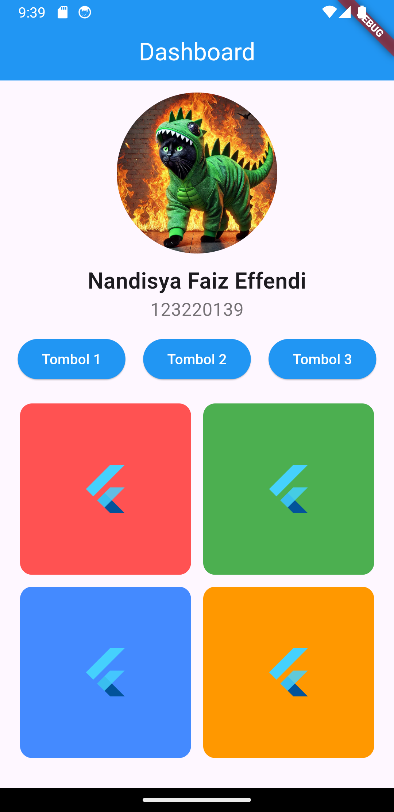

<div align="center">
   
</div>

# 📱 Tugas 1 Mobile

🚀 **Repositori ini berisi tugas pertama untuk mata kuliah Mobile Development.**

---

## 📌 Deskripsi
Tugas ini mencakup pembuatan layout aplikasi mobile sederhana menggunakan framework yang ditentukan oleh dosen.

## ✨ Fitur
✅ Tampilan antarmuka sederhana  
✅ Fungsi dasar sesuai dengan ketentuan tugas  
✅ Responsif di berbagai ukuran layar  

## 🔧 Instalasi
1. Clone repositori ini:
   ```sh
   git clone https://github.com/faiz-effendi/tugas1_mobile.git
   ```
2. Buka proyek di Android Studio atau editor yang sesuai.

## 👨‍💻 Kontributor
- **Faiz Effendi | 123220139**

---
💡 *Happy Coding!* 🚀
